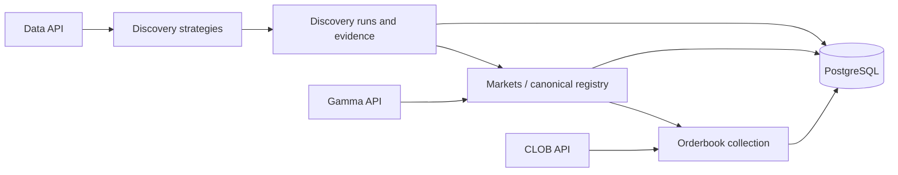

# Polymarket Market Discovery

`polymarket-market-discovery` builds and maintains a canonical,
strategy-defined universe of Polymarket markets. It records why each market was
discovered, enriches it with current market and token data, and collects
periodic orderbook snapshots for backtesting.

The canonical market registry is the primary output. The repository does not
attempt to mirror every Polymarket market: its universe contains only markets
found by the selected discovery strategies. PostgreSQL is the output interface;
the service does not expose a separate read API.

The service exclusively uses public read endpoints. It never places orders,
executes trades, or moves funds.

## Core concepts

### Strategies

A strategy is a pluggable rule for deciding which markets are relevant to the
universe. It reads public Polymarket data and emits normalized observations with
a `condition_id`, an observation time, and supporting evidence.

Strategies only discover candidates. They do not decide the canonical market
status, own token identity, or collect orderbooks. This separation allows new
discovery signals to be added without changing the downstream registry and
collection layers.

The currently registered strategy is `whale_leaderboard_intersection`. The
`--strategy` CLI option selects strategies and can be repeated. Without the
option, all registered strategies run.

### Discovery

Discovery executes the selected strategies and stores every run and observation
append-only. Repeated evidence from one strategy for the same market is
aggregated into a single market observation while retaining the individual
evidence items.

Discovery history explains how and when a market entered consideration. It is
not the current collection universe and does not determine whether a market is
still tradable.

### Markets / Market Registry

Markets turns discovery candidates into the canonical market universe. It
deduplicates markets by `condition_id` and uses the Gamma API to maintain current
metadata, status, end date, and both outcome tokens.

Newly discovered markets and all stored non-terminal markets are checked again.
Once discovered, a market remains in the registry, including after it becomes
closed or archived. Terminal markets are retained as canonical history but are
no longer scheduled for regular refresh.

### Orderbooks

Orderbooks collects both outcome tokens for canonical markets that currently
match all of these conditions:

- `active=true`
- `closed=false`
- `archived=false`
- `enable_order_book=true`

Each collection stores the raw book and parsed values such as best prices,
spread, midpoint, and top-level depth. The result is periodic snapshot history
for backtesting. It is not tick data, trade history, or execution history.

## Data flow



## Pipeline coordination

The coordinator bootstraps the service sequentially:

```text
Discovery -> Markets -> Orderbooks
```

After bootstrap, Discovery and Markets run on fixed 15-minute deadlines and
Orderbooks runs every 5 minutes. A successful upstream run can cascade into the
next layer without shifting its fixed deadline. Missed ticks are coalesced into
one run instead of producing catch-up bursts.

All layers share a PostgreSQL advisory lock so they do not write concurrently.
A fresh, last-known-good registry remains available when an upstream layer
fails. For scheduled runs, the last completed registry sync may be at most twice
the configured Markets interval old before Orderbook collection is skipped.

## Running the service

### Start with Docker Compose

```bash
cp .env.example .env
make postgres
make cli ARGS="init-db"
make up
```

The database baseline must be initialized before the scheduler starts.
The regular Make targets use Docker Compose with the local `.env` file. The
same commands remain available through Doppler with the `doppler-` prefix, for
example `make doppler-up` or `make doppler-cli ARGS="init-db"`.

### Run individual layers

```bash
polymarket-market-discovery run discovery
polymarket-market-discovery run markets
polymarket-market-discovery run orderbooks
polymarket-market-discovery run all
```

`run all` executes Discovery, Markets, and Orderbooks sequentially and aggregates
layer errors into one pipeline result.

Manual Orderbook runs accept
`--market-registry-max-age-seconds`; its default is 1800 seconds. Market and
Orderbook request batch sizes can be changed with `--market-batch-size` and
`--orderbook-batch-size`.

### Run continuously

```bash
polymarket-market-discovery schedule
```

The default intervals are 900 seconds for Discovery, 900 seconds for Markets,
and 300 seconds for Orderbooks. They can be overridden with
`--discovery-interval`, `--markets-interval`, and `--orderbooks-interval`.

## PostgreSQL output

The persisted tables are the service's read interface for downstream research
and backtesting consumers.

| Layer | Tables |
| --- | --- |
| Discovery | `market_discovery_runs`, `market_discovery_observations` |
| Markets | `market_registry_sync_runs`, `polymarket_markets`, `polymarket_tokens`, `market_status_snapshots` |
| Orderbooks | `orderbook_collection_runs`, `orderbook_collection_items`, `orderbook_snapshots` |

Orderbook selection reads the canonical `polymarket_markets` and
`polymarket_tokens` tables rather than reconstructing a universe from discovery
history.

## Known problems

Current architectural and operational limitations are documented in the
[Known Problems wiki](wiki/known-problems/KNOWN-PROBLEMS_INDEX.md).

## Database baseline

This repository uses a fresh database baseline. Legacy watchlist tables and
views are not migrated. Existing databases and Docker Compose volumes must be
recreated before initializing this baseline.
